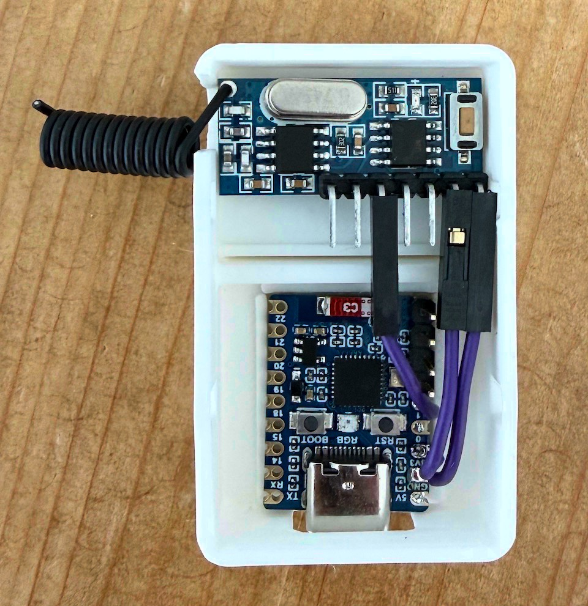
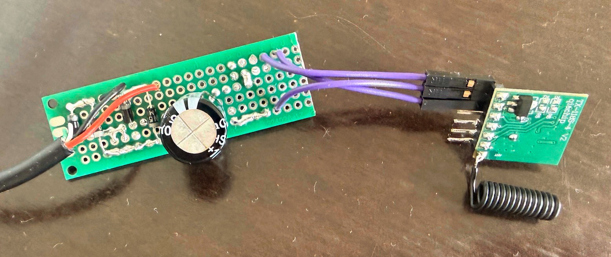

# ha-doorbell

Makes a classic german wired doorbell ([Grothe Gong 165](https://www.urmet.de/media/7e/de/96/1769671346/Installationsanleitung_Elektromechanische-Gongs_165-Reihe.pdf?ts=1769671346)) show up in Home Assistant as `binary_sensor.doorbell`, without touching the mains wiring or running new cables.

No dedicated power source is needed, the sender runs off the same voltage that powers the bell.

The link between bell and Home Assistant is a 433 MHz radio signal.

## How it fits together

```
Doorbell button -> Bell transformer -> gong terminals ─> [sender] ~~~ 433 MHz ~~~ [receiver] -> Wi-Fi -> Home Assistant
```

- **[sender/](sender)**: A small board wired to the gong terminals. It is powered by the bell voltage itself: pressing the button powers a TX118SA-4 module that transmits while the button is held. No battery, no extra supply.
- **[receiver/](receiver)**: An always-on, USB-powered ESP32-C6 with an RX480E-4 receiver, running ESPHome. It exposes the doorbell as a binary sensor that Home Assistant auto-discovers.

A note on antennas: While my documentation referes to 17.3 cm straight wire antennas throughout, the [433 kit](https://www.amazon.de/QIACHIP-Fernbedienung-integrierter-4-Kanal-Ausgang-Empfänger-Set/dp/B06ZZ1Z6R7) I bought included two small, coiled antennas and I ended up using those.

## Getting started

1. Measure your bell's terminal voltage to confirm the design fits: [bell_measurement.md](bell_measurement.md)
2. Build and install the sender: [sender/README.md](sender/README.md)
3. Build, flash, and pair the receiver: [receiver/README.md](receiver/README.md)
4. You now have a binary sensor in Home Assistant that changes state while the doorbell button is pressed

## WARNING

> **No guarantees.** I am not an electrician; these instructions document what worked for *my* bell (Grothe Gong 165, 8–12 V AC at the gong terminals) and come without any warranty. Similar setups will likely work the same way, but wiring schemes differ. Your bell circuit may carry higher voltage or current and may be dangerous. When in doubt have the work done or checked by a qualified electrician. Proceed at your own risk.

## Images

 