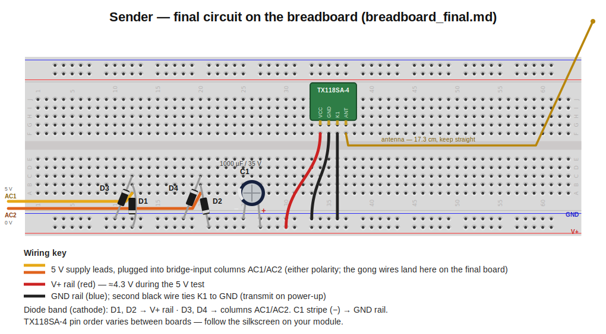
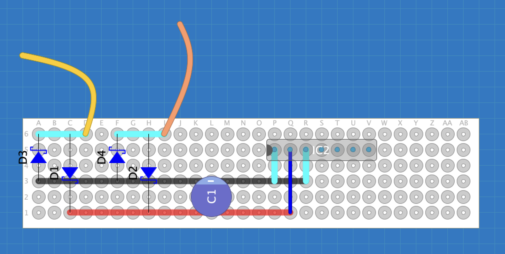

# 433 MHz Doorbell Sender

Powered directly from the bell wires: when the doorbell button is pressed, ~8 V AC appears on the gong terminals, gets rectified, and powers a TX118SA-4 transmitter whose channel K1 is permanently tied to GND, so power-up = transmitting. No battery, no permanent supply.

Before building, measure your own bell as described in [../bell_measurement.md](../bell_measurement.md). This design assumes the ideal case: 0 V idle, constant 8–12 V AC while the button is held.

## Parts

| Ref | Part |
|---|---|
| D1–D4 | 4× Schottky diode **1N5819** (bridge rectifier) |
| C1 | Electrolytic capacitor **1000 µF / 35 V** |
| TX1 | **TX118SA-4** 433 MHz transmitter (3–24 V variant. Check before wiring, a 3.3–5 V variant needs a 5 V regulator) |
| ANT | 17.3 cm straight wire, soldered to the module's ANT pad |
| - | Perfboard, 2-pin screw terminal, wire, small enclosure |

Build in three stages, each verified before the next.

## Stage 1: Breadboard quick test (module only)

Confirms the module transmits continuously while powered with K1 grounded.

| TX118SA-4 pad | Connect to |
|---|---|
| VCC | +5 V supply |
| GND | supply GND |
| K1 (channel A) | short to GND |
| ANT | 17.3 cm wire, kept straight |

Pair the receiver as described in [../receiver/README.md](../receiver/README.md). The module should transmit and the receiver triggers for as long as power is applied.

## Stage 2: Breadboard final circuit

The full circuit (bridge -> C1 -> module), still on the 5 V bench supply.

Orientation: diode band (silver/gray stripe) = cathode; C1's longer leg = **+**, stripe = **−**. Use the breadboard rails as **V+** and **GND**; pick two free columns as bridge inputs **AC1** and **AC2** (the supply leads plug in there. On the final board this is where the gong wires land).

| Part | From | To |
|---|---|---|
| D1 | anode: AC1 | cathode (band): V+ rail |
| D2 | anode: AC2 | cathode (band): V+ rail |
| D3 | anode: GND rail | cathode (band): AC1 |
| D4 | anode: GND rail | cathode (band): AC2 |
| C1 | **+**: V+ rail | **−** (stripe): GND rail |
| TX118SA-4 | VCC: V+ rail, GND + K1: GND rail | ANT: 17.3 cm wire |

Quick check: all four diode bands "point away" from GND. A flipped diode or reversed C1 shorts the bridge.

Tests, in order:

1. **Pre-power**: no supply: resistance/diode mode between V+ and GND must not read a short (a slowly climbing value while C1 charges is normal).
2. **DC smoke test**: 5 V into AC1, 0 V into AC2 (into the AC columns, *not* the rails): expect **V+ ≈ 4.2–4.5 V** and the receiver triggers.
3. **Polarity swap**: swap the supply leads: must work identically (AC has no polarity).

## Stage 3: Perfboard and install

Solder the identical circuit onto a perfboard (also see `perfboard.diy` for a [DIYLC](https://bancika.github.io/diy-layout-creator/) file).

Component side:

| Part | Holes | Orientation |
|---|---|---|
| J1 wires (to the gong) | `D6` (AC1), `I6` (AC2) | off-board hookup wires (yellow/orange in the image) |
| D1 | anode `C6` -> cathode `C1` | along column C, band toward row 1 |
| D2 | anode `H6` -> cathode `H1` | along column H, band toward row 1 |
| D3 | anode `A3` -> cathode `A6` | along column A, band toward row 6 |
| D4 | anode `F3` -> cathode `F6` | along column F, band toward row 6 |
| C1 | `L1` (+), `L3` (− stripe) | 5 mm pitch fits the 2-row spacing |
| TX118SA-4 | header into `P5`–`V5` | upright along the top edge; GND lands in `P5`, V+ in `Q5`, K1 in `R5` |
| V+ jumper | `Q1` -> `Q5` | insulated wire (dark blue): it crosses the GND run at `Q3` and must not touch it |
| Antenna | - | soldered to the module's ANT pad, pointing up |

Solder side (bare bus wire flat along the rows):

| Net | Run | Joins |
|---|---|---|
| AC1 | row 6, `A6`–`D6` | J1 wire, D3 cathode, D1 anode |
| AC2 | row 6, `F6`–`I6` | J1 wire, D4 cathode, D2 anode |
| V+ | row 1, `C1`–`Q1` | D1 cathode, D2 cathode, C1 +, V+ jumper up to the module |
| GND | row 3, `A3`–`R3`, plus risers `P3`–`P5` and `R3`–`R5` | D3 anode, D4 anode, C1 −, module GND, K1 |

**Install:** connect J1 across the gong's terminals (either way round - the bridge handles both polarities). Mount the board in a small enclosure near the gong, antenna straight and unobstructed.

## Enclosure

No enclosure is provided. The goal was to fit the board into the enclosure of the bell itself, but because the capacitor ended up being very large and because the whole thing was rather unwieldy, i ended up cutting a small hole into the bells enclosure and haveing the raw board hanging outside the bell.